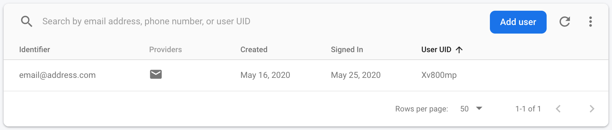
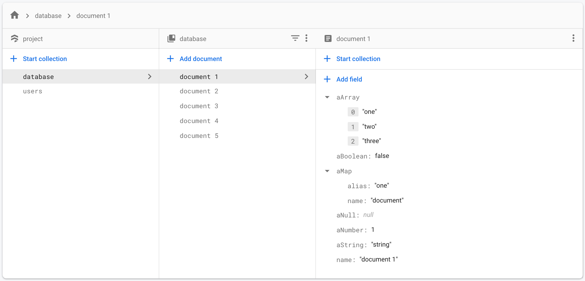
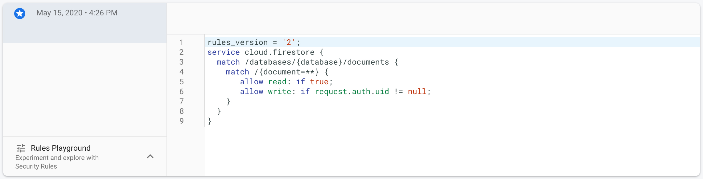

# Vercel NextJs + Google Firebase + Google Material UI Study

Simple Google Firebase study using Vercel NextJs with Google Material UI.

The firebase app is initialized in `firebase/clientApp.js`. To use it, just import it anywhere in the app. The application is using React Context API for state management.

## Configuration

- [Create a Firebase project](https://console.firebase.google.com/u/0/) and add a new app to it.

- 🔑 Firebase Authentication



- 👨 Firebase Databse (`users`)


- 📄 Firebase Database (`database`)



- ⚙️ Firebase Database Rules



- Create a `.env` file and copy the contents of `.env.example` into it.

```bash
cp .env.example .env
```

- Set each variable on `.env` with your Firebase Configuration (found in "Project settings").

- Install it and run the application

```bash
npm install
npm run dev

# or

yarn
yarn dev
```

## Notes:

If you will use [Vercel](https://vercel.com/), keys will be coming from Vercel Secret keys.

```
"@firebase-api-key"
"@firebase-auth-domain"
"@firebase-database-url"
"@firebase-project-id"
"@firebase-storage-bucket"
"@firebase-messaging-sender-id"
"@firebase-app-id"
```

## Question:

If you have question, you can always contact me on Twitter [@genesis_neo](https://twitter.com/genesis_neo) and of course here in GitHub [@genesisneo](https://github.com/genesisneo). Thank you.

---

<p align="center">-=[ :heart: ]=-</p>
